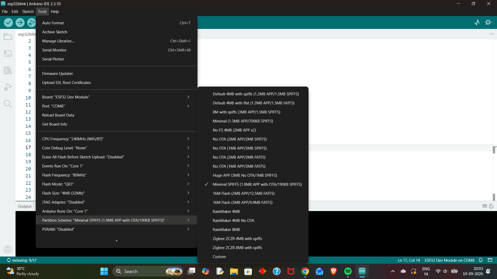

# Build Environment

## Development Environment

The project uses the **Arduino framework** with the **Espressif Arduino Core for ESP32** for development of the Wi-Fi edge node.

### Board Configuration

| Setting           | Configuration    |
| ----------------- | ---------------- |
| Development Board | ESP32 Dev Module |
| Framework         | Arduino          |
| Arduino Core      | ESP32 3.x        |
| Upload Port       | COM11            |
| Serial Monitor    | 115200 baud      |
| Partition Scheme  | Minimal SPIFFS   |

The ESP32 Arduino core was installed through the Arduino IDE Boards Manager.

---

## Partition Scheme

The **Minimal SPIFFS** partition scheme was selected for the project.

The ESP32 uses flash memory for both the application firmware and filesystem storage. The partition scheme determines how this flash memory is divided between the firmware and filesystem.

Minimal SPIFFS provides sufficient application space while retaining filesystem space for future project requirements.

The filesystem space can be used later for:

* Configuration files
* Persistent device settings
* Sensor configuration
* Other local data

The selected partition scheme also keeps the project suitable for future development involving **OTA firmware updates**, planned for a later stage of the project.

---

## Required Libraries

The following libraries were installed through the Arduino IDE Library Manager:

| Library                 | Purpose                                                  |
| ----------------------- | -------------------------------------------------------- |
| DHT sensor library      | Interface with the DHT22 temperature and humidity sensor |
| Adafruit Unified Sensor | Sensor library dependency                                |
| PubSubClient            | MQTT communication                                       |
| ArduinoJson             | JSON data formatting and parsing                         |

### Installation Status

* **DHT sensor library:** Installed
* **Adafruit Unified Sensor:** Installed
* **PubSubClient:** Installed
* **ArduinoJson:** Installed

The libraries were verified through the Arduino IDE Library Manager and are available for use in the project.

---

## Build Verification

The ESP32 development environment was tested by compiling and uploading a test sketch.

The test confirmed that the selected ESP32 board configuration and required libraries are correctly recognized by the Arduino IDE.

The Serial Monitor was configured at **115200 baud** for runtime verification.

---

## Environment Summary

| Component               | Status     |
| ----------------------- | ---------- |
| ESP32 Arduino Core      | Installed  |
| ESP32 Dev Module        | Configured |
| Minimal SPIFFS          | Selected   |
| DHT sensor library      | Installed  |
| Adafruit Unified Sensor | Installed  |
| PubSubClient            | Installed  |
| ArduinoJson             | Installed  |
| Build test              | Verified   |

The development environment is ready for subsequent sensor integration and Wi-Fi edge-node development.
